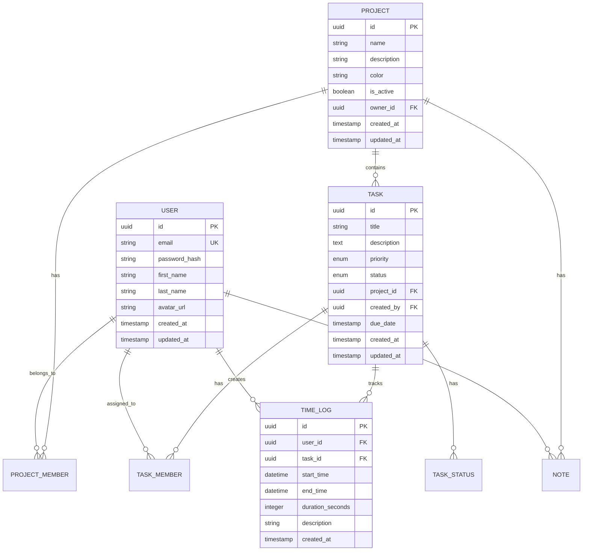

# TimeTracker - Описание проекта

## 📊 Обзор проекта

**TimeTracker** — это современная система управления проектами и отслеживания времени, разработанная с использованием современных веб-технологий. Проект представляет собой полнофункциональное веб-приложение для команд, работающих над различными проектами и задачами.

### 🎯 Основная цель

Создание интуитивного инструмента для:
- Управления проектами и задачами
- Отслеживания времени работы
- Координации команды
- Анализа продуктивности
- Планирования ресурсов

## 🏗️ Архитектура системы

### Общая архитектура

```
┌─────────────────┐    ┌─────────────────┐    ┌─────────────────┐
│   React SPA     │    │   NestJS API    │    │  PostgreSQL DB  │
│   (Frontend)    │◄──►│   (Backend)     │◄──►│   (Database)    │
└─────────────────┘    └─────────────────┘    └─────────────────┘
        │                       │                       │
        │              ┌─────────────────┐               │
        └──────────────►│  Nginx Proxy    │◄──────────────┘
                       │ (Production)    │
                       └─────────────────┘
```

### Монорепозиторий

Проект организован как монорепозиторий с четким разделением ответственности:

```
TimeTracker/
├── apps/
│   ├── frontend/         # React приложение
│   └── backend/          # NestJS API сервер
├── scripts/              # Скрипты автоматизации
├── nginx/               # Конфигурация веб-сервера
└── docker-compose.yml   # Оркестрация контейнеров
```

## 🛠️ Технологический стек

### Frontend (React SPA)

| Технология | Версия | Назначение |
|------------|--------|------------|
| **React** | 19.0 | Основной UI фреймворк |
| **TypeScript** | ~5.7 | Статическая типизация |
| **Vite** | ^6.2 | Сборщик и dev-сервер |
| **Tailwind CSS** | ^4.0 | Utility-first CSS |
| **shadcn/ui** | ^0.9 | Компонентная библиотека |
| **Radix UI** | ^1.x | Примитивы для доступности |
| **Redux Toolkit** | ^1.9 | Управление состоянием |
| **React Router** | ^7.4 | Клиентская маршрутизация |
| **React Hook Form** | ^7.55 | Управление формами |
| **Zod** | ^3.24 | Валидация схем |
| **Framer Motion** | ^12.10 | Анимации |
| **TipTap** | ^2.11 | Богатый текстовый редактор |

### Backend (NestJS API)

| Технология | Версия | Назначение |
|------------|--------|------------|
| **NestJS** | ^10.0 | Node.js фреймворк |
| **TypeScript** | ^5.3 | Статическая типизация |
| **TypeORM** | ^0.3 | ORM для работы с БД |
| **PostgreSQL** | 14 | Основная база данных |
| **JWT** | ^10.2 | Аутентификация |
| **Passport** | ^0.7 | Стратегии аутентификации |
| **bcrypt** | ^5.1 | Хеширование паролей |
| **class-validator** | ^0.14 | Валидация DTO |
| **Swagger** | ^7.3 | Документация API |
| **Jest** | ^29.7 | Тестирование |

### DevOps и инфраструктура

| Технология | Назначение |
|------------|------------|
| **Docker** | Контейнеризация |
| **Docker Compose** | Оркестрация сервисов |
| **Nginx** | Обратный прокси и статика |
| **Adminer** | Веб-интерфейс для БД |
| **PostgreSQL** | Основная БД |

## 📋 Основные функции

### 👥 Управление пользователями
- Регистрация и аутентификация
- Профили пользователей с аватарами
- Система ролей и разрешений
- Управление командами

### 📁 Управление проектами
- Создание и настройка проектов
- Приглашение участников
- Разделение по ролям в проекте
- Настройка видимости и доступа

### ✅ Управление задачами
- Создание и редактирование задач
- Канбан-доска для визуального управления
- Приоритеты и статусы
- Назначение исполнителей
- Комментарии и файлы

### ⏱️ Отслеживание времени
- Старт/стоп таймера
- Ручной ввод времени
- История временных записей
- Категоризация по проектам/задачам

### 📊 Аналитика и отчеты
- Временные отчеты по проектам
- Статистика продуктивности
- Графики и диаграммы
- Экспорт данных

### 📝 Заметки и документация
- Богатый текстовый редактор
- Совместное редактирование
- Версионность заметок
- Связь с проектами/задачами

### 🔔 Уведомления
- Уведомления о назначениях
- Напоминания о задачах
- Изменения в проектах
- Настройка предпочтений

## 💾 Модель данных

### Основные сущности



### Основные связи

1. **Пользователи ↔ Проекты** (Many-to-Many через PROJECT_MEMBER)
2. **Пользователи ↔ Задачи** (Many-to-Many через TASK_MEMBER)
3. **Проекты ↔ Задачи** (One-to-Many)
4. **Пользователи ↔ Логи времени** (One-to-Many)
5. **Задачи ↔ Логи времени** (One-to-Many)

## 🎨 UI/UX дизайн

### Дизайн-система

- **Цветовая палитра**: Адаптивная темная/светлая тема
- **Типографика**: Inter font family для читаемости
- **Компоненты**: Единая система на базе shadcn/ui
- **Иконки**: Lucide React для консистентности
- **Анимации**: Плавные переходы с Framer Motion

### Основные экраны

1. **Дашборд** - обзор активности и задач
2. **Проекты** - список и детали проектов
3. **Задачи** - канбан-доска и списки
4. **Время** - трекер и статистика
5. **Команда** - управление участниками
6. **Настройки** - конфигурация профиля

### Адаптивность

- **Desktop-first** подход
- Поддержка планшетов (768px+)
- Мобильная версия (320px+)
- Touch-friendly интерфейс

## 🔐 Безопасность

### Аутентификация и авторизация

- **JWT токены** для сессий
- **HTTP-only cookies** для безопасности
- **Refresh tokens** для продления сессий
- **Role-based access control** (RBAC)

### Защита данных

- **bcrypt** для хеширования паролей
- **HTTPS** в продакшене
- **CORS** настройки
- **Rate limiting** для API
- **Input validation** на всех уровнях

### Приватность

- Шифрование чувствительных данных
- Логирование доступа к данным
- Возможность удаления аккаунта
- Соответствие GDPR принципам

## 🚀 Развертывание

### Окружения

#### Разработка (Development)
- **Hot reload** для frontend и backend
- **Source maps** для отладки
- **Mock данные** для тестирования
- **Детальные логи** ошибок

#### Продакшн (Production)
- **Минификация** кода
- **Кэширование** статики
- **Load balancing** через Nginx
- **Health checks** для мониторинга
- **SSL/TLS** шифрование

### Контейнеризация

```yaml
services:
  frontend:    # React SPA на Nginx
  backend:     # NestJS API сервер
  postgres:    # PostgreSQL база данных
  adminer:     # Веб-интерфейс БД (dev only)
```

### CI/CD пайплайн

Планируемые этапы:
1. **Lint & Type check** - проверка качества кода
2. **Unit tests** - тестирование компонентов
3. **Integration tests** - тестирование API
4. **Build** - сборка приложений
5. **Deploy** - развертывание в окружения

## 📈 Масштабируемость

### Производительность

- **Code splitting** для оптимизации загрузки
- **Lazy loading** компонентов
- **Мемоизация** тяжелых вычислений
- **Database indexing** для быстрых запросов
- **API пагинация** для больших списков

### Мониторинг

Планируемые инструменты:
- Логирование ошибок
- Метрики производительности
- Мониторинг доступности
- Аналитика использования

## 🔮 Планы развития

### Краткосрочные цели (Q1-Q2)
- [ ] Улучшение UI/UX
- [ ] Мобильное приложение
- [ ] Интеграция с календарями
- [ ] Расширенная аналитика
- [ ] API для сторонних сервисов

### Долгосрочные цели (Q3-Q4)
- [ ] Машинное обучение для прогнозов
- [ ] Интеграция с популярными инструментами
- [ ] Многоязычная поддержка
- [ ] Продвинутая система уведомлений
- [ ] Корпоративные функции

## 👥 Команда разработки

### Роли и ответственность

- **Frontend Developer** - React, TypeScript, UI/UX
- **Backend Developer** - NestJS, PostgreSQL, API
- **DevOps Engineer** - Docker, CI/CD, мониторинг
- **Product Manager** - требования, планирование
- **QA Engineer** - тестирование, качество

### Процесс разработки

1. **Планирование** спринтов (2 недели)
2. **Code review** для всех изменений
3. **Automated testing** перед merge
4. **Continuous deployment** в dev/staging
5. **Release management** для продакшена

## 📞 Контакты и поддержка

- **Repository**: [GitHub Link]
- **Documentation**: [Docs Link]
- **Issue Tracker**: [Issues Link]
- **Team Chat**: [Slack/Discord Link]

---

**TimeTracker** разрабатывается с фокусом на производительность, безопасность и пользовательский опыт. Проект использует современные технологии и лучшие практики разработки для создания надежного и масштабируемого решения. 