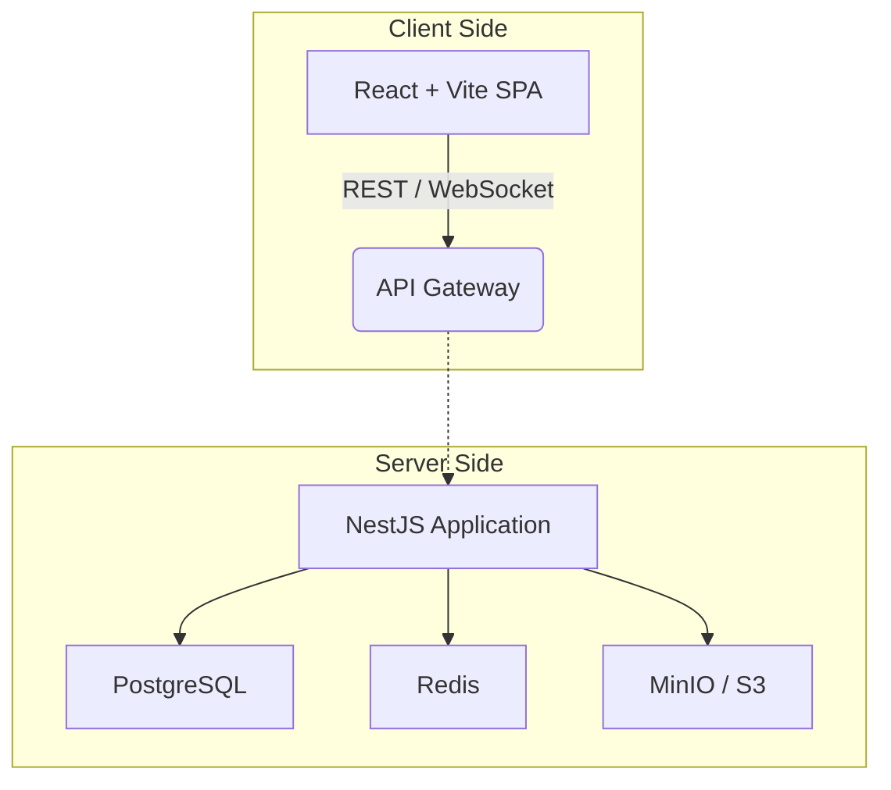
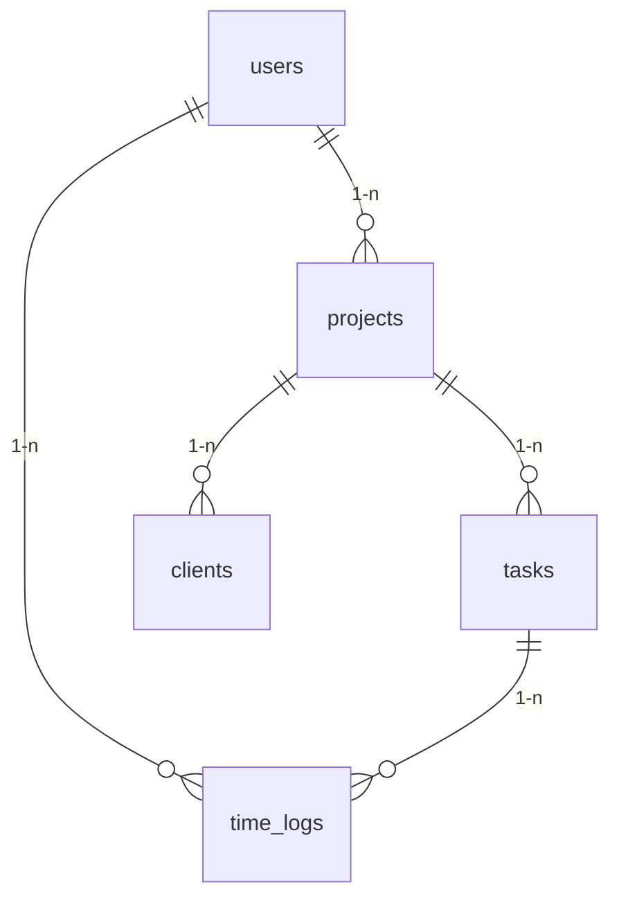

# Документ дизайна приложения «TimeTracker»

## 1. Общее описание
TimeTracker — это полнофункциональная система учёта рабочего времени и управления проектами, предназначенная для малых и средних команд. Приложение включает backend-часть на NestJS и frontend-часть на React + Vite, что обеспечивает высокую производительность, модульность и простую масштабируемость.

---

## 2. Архитектура высокого уровня



1. **React SPA** — отвечает за UI/UX, маршрутизацию и управление состоянием на клиенте.
2. **API Gateway (nginx)** — терминирует HTTPS, выполняет балансировку и проксирование запросов к NestJS.
3. **NestJS** — реализует бизнес-логику, REST API, WebSocket-уведомления и задачи cron.
4. **PostgreSQL** — основное хранилище данных, миграции управляются `typeorm`.
5. **Redis** — кэш и брокер для очередей (BullMQ), хранение сессий WebSocket.
6. **MinIO / S3** — хранилище пользовательских файлов (аватары, вложения).

---

## 3. Backend

### 3.1 Слои и принципы
- **Controller → Service → Repository** (DDD-подход с вниманием к SOLID).
- Валидация входных данных через `class-validator` и `class-transformer`.
- Глобальные фильтры (`HttpExceptionFilter`) и перехватчики (`TransformInterceptor`, `PaginationInterceptor`).

### 3.2 Основные модули
| Модуль            | Назначение                           |
|-------------------|--------------------------------------|
| `auth`            | JWT-аутентификация и OAuth2          |
| `users`           | CRUD пользователей и роли            |
| `projects`        | Управление проектами                 |
| `tasks`           | Канбан-задачи и состояния            |
| `time_logs`       | Учёт времени                         |
| `notifications`   | Real-time уведомления (WS + email)   |
| `plans`           | Тарифные планы и биллинг             |

### 3.3 Безопасность
- JWT (access + refresh) + `HttpOnly` cookies.
- RBAC через декоратор `@Roles()` и `RoleGuard`.
- Rate limiting на уровне nginx и NestJS (`@Throttle`).

---

## 4. Frontend

### 4.1 Технологический стек
- **React 18** + **TypeScript**.
- **Vite** — сборка и HMR.
- **Redux Toolkit / RTK Query** — глобальное состояние и работа с API.
- **React Router v6** — маршрутизация.
- **ShadCN/ui + TailwindCSS** — дизайн-система.

### 4.2 Структура каталогов
```bash
src/
  app/        # конфигурация стора и роутера
  entities/   # UI-слои бизнес-сущностей (FSD)
  features/   # пользовательские сценарии
  pages/      # страницы маршрутов
  shared/     # переиспользуемые утилиты, ui, api
```
Следуем методологии **Feature-Sliced Design** для масштабируемой фронтенд-архитектуры.

### 4.3 Управление состоянием
- **RTK Query** генерирует хуки для запросов и кэширует данные.
- **Zustand** опционально для узкоспециализированного локального состояния.

### 4.4 Маршрутизация
| Путь                  | Компонент / Страница             |
|-----------------------|----------------------------------|
| `/`                   | Home                             |
| `/projects`           | ProjectsList                     |
| `/projects/:id`       | ProjectDashboard                 |
| `/tasks`              | TasksBoard                       |
| `/time-logs`          | TimeLogs                         |
| `/settings`           | Settings                         |

### 4.5 UI/UX
- Адаптивная сетка на Tailwind: mobile-first.
- Светлая и тёмная тема через CSS-переменные.
- Компонент `PlayPauseButton` обеспечивает мгновенный фидбек (вибрация/анимация).
- Skeletons и оптимистичные обновления для плавного UX.

---

## 5. База данных



- Используются связи `@OneToMany`/`@ManyToOne` с каскадным удалением.
- Soft delete через поле `deleted_at` и глобальный фильтр.

---

## 6. Интеграции и внешние сервисы
- **SMTP (SendGrid)** — transactional email.
- **Sentry** — мониторинг ошибок.
- **Prometheus + Grafana** — метрики и алерты.
- **Docker** — контейнеризация; `docker-compose.dev.yml` для локальной среды.

---

## 7. CI/CD
1. **GitHub Actions**
   - Lint → Test → Build → Docker Push.
2. **Terraform** (опционально) для облачной инфраструктуры.
3. **Docker Swarm / Kubernetes** для продакшен-околений.

---

## 8. Требования к качеству кода
- Полное покрытие JSDoc для всех публичных API и функций.
- ESLint + Prettier + Husky (pre-commit).
- Строгий стиль импортов по алиасам (`@/shared/*`).

---

## 9. Потенциальные направления развития
- Микросервисная сегментация (Auth, Billing, Notifications).
- GraphQL API для сложных выборок.
- Мобильное приложение на React Native.

---

> Документ предназначен для нейросетевой обработки; все детали реализации описаны с учётом потенциальной автоматизации. 