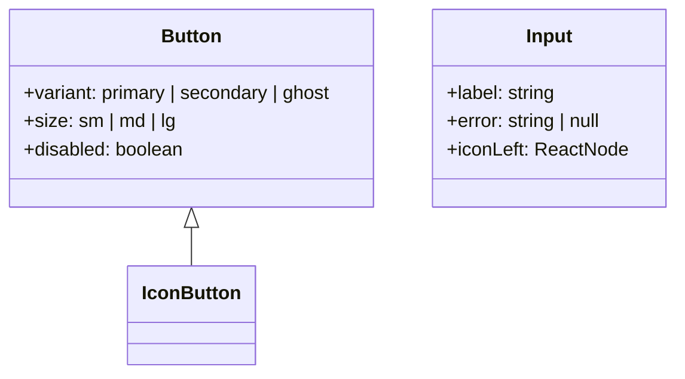

# UI-дизайн приложения «TimeTracker»

## 🎨 1. Цветовая палитра
| Токен | HEX | Применение |
|-------|-----|------------|
| `--color-primary` | `#4F46E5` | Акцентные элементы: кнопки, ссылки, активные иконки |
| `--color-primary-hover` | `#4338CA` | Ховер и активные состояния |
| `--color-secondary` | `#F59E0B` | Вспомогательные метки и графики |
| `--color-bg` | `#FFFFFF` | Фон светлой темы |
| `--color-bg-dark` | `#18181B` | Фон тёмной темы |
| `--color-surface` | `#F9FAFB` | Карточки, панели |
| `--color-border` | `#E5E7EB` | Линии разделения |
| `--color-error` | `#EF4444` | Сообщения об ошибке |
| `--color-success` | `#10B981` | Успешные уведомления |

> Цвета оформлены как CSS-переменные и подключаются через Tailwind config (`extend.colors`).

## 🔤 2. Типографика
| Размер | Токен | Tailwind класс | Применение |
|--------|-------|----------------|------------|
| `32px` | `--text-3xl` | `text-3xl` | Заголовок раздела |
| `24px` | `--text-2xl` | `text-2xl` | Заголовок страницы |
| `20px` | `--text-xl`  | `text-xl`  | Подзаголовок |
| `16px` | `--text-base`| `text-base`| Основной текст |
| `14px` | `--text-sm`  | `text-sm`  | Подписи и второстепенный текст |
| `12px` | `--text-xs`  | `text-xs`  | Теги, хелперы |

Шрифт по умолчанию — **Inter** (fallback: system-ui). Высота строки `1.5` для читаемости.

## 🧩 3. Дизайн-система и компоненты
- Основная библиотека — **ShadCN/ui**, все компоненты оборачиваются слоями из каталога `shared/ui`.
- Компоненты атомарного уровня (кнопки, иконки, бейджи) располагаются в `shared/ui`.
- Сложные компоненты (карточки, таблицы, графики) — в `entities/*`.
- Состояния _loading, empty, error_ вынесены в отдельные UI составляющие.



## 📐 4. Сетка и отступы
- Контентная ширина: **1280 px** (desktop).
- Колонки: **12** (desktop), **6** (tablet), **4** (mobile).
- Базовый модуль: **4 px** (все отступы кратны 4).
- Используем Tailwind utility-классы (`gap-4`, `p-6` и т. д.).

## 🌗 5. Темы (light / dark)
- Поддержка CSS-переменных: переключатель темы изменяет корневые токены.
- Анимация перехода темы — `0.3s` на свойства `background-color`, `color`.

## 🏃‍♂️ 6. Состояния и анимации
- **Hover/Focus**: `opacity-90` + лёгкий подъём `translate-y-[-2px]`.
- **Active/Pressed**: `scale-95`.
- **Skeleton**: shimmer-анимация через `keyframes`.
- **Modal / Drawer**: стек по уровню z-index (100–130).

## ♿ 7. Доступность
- Контраст текста не ниже **AA** (WCAG 2.1).
- Фокус-кольцо: `2px` сплошной, цвет `--color-primary`.
- Все интерактивные элементы имеют атрибуты `aria-*` и подсказки.

## 🛠 8. Токены и переменные
Токены генерируются из Figma через **Style Dictionary** и автоматически синхронизируются с `tailwind.config.ts`.

```jsonc
// tailwind.theme.extend.colors
"primary": "var(--color-primary)",
"bg": {
  "DEFAULT": "var(--color-bg)",
  "dark": "var(--color-bg-dark)"
}
```

## 🔗 9. Навигация
| Компонент | Расположение | Особенности |
|-----------|--------------|-------------|
| Sidebar   | слева (desktop), снизу (mobile) | Кастомный scroll + скрытие текста |
| TopBar    | фиксированный, высота 56 px    | Информеры, аватар пользователя   |
| Breadcrumbs | под TopBar                    | Контекст текущей страницы        |

## 📈 10. Графики и визуализации
Используется **Recharts** с кастомными theme-настройками. Цвета графиков берутся из токенов `--color-primary`, `--color-secondary`.

## 🧪 11. Тестирование UI
- **Storybook** + **Chromatic** для визуальных регрессий.
- **Playwright** для end-to-end сценариев.

## 📑 12. Страницы и пользовательские сценарии

| Страница | URL | Ключевые элементы UI | Основной пользовательский поток |
|----------|-----|----------------------|--------------------------------|
| **Логин** | `/auth/login` | Форма email + password, кнопка «Войти», ссылка «Забыли пароль?» | Ввод данных → валидация → запрос `POST /auth/login` → редирект на `/` |
| **Регистрация** | `/auth/register` | Multi-step wizard (1. Учётная запись, 2. Компания, 3. План) | Заполнение шагов → прогресс-бар → подтверждение email |
| **Домашняя (Dashboard)** | `/` | Overview-виджеты: Today Time, Active Tasks, Recent Projects, график активности | Быстрый старт отсчёта времени → переход к задачам/проектам |
| **Список проектов** | `/projects` | Таблица проектов, фильтры, кнопка «+ New Project» | Выбор проекта → переход к `/projects/:id` |
| **Проект (Dashboard)** | `/projects/:id` | Канбан-доска, метрики (бурндаун, velocity), вкладки: Overview, Tasks, Team, Files | Добавление/редактирование задач, управление участниками |
| **Задачи (Board)** | `/tasks` | Канбан с колонками статусов, drag-and-drop, фильтры пользователей/меток | Перетаскивание задач → inline-редактирование → трекинг времени |
| **Задача (Detail)** | `/tasks/:id` (modal) | Описание, чек-листы, комментарии (tiptap), история изменений | Добавление заметок, изменение статуса, лог времени |
| **Тайм-логи** | `/time-logs` | Таблица логов, календарь, отчёты, экспорт (CSV/PDF) | Фильтр по пользователям/проектам → генерация отчёта → экспорт |
| **Клиенты** | `/clients` | Карточки клиентов, поиск, CRUD-модал | Добавление клиента → привязка к проекту |
| **Контакты** | `/contacts` | Список контактов, быстрый звонок/почта, теги | Поиск → просмотр детальной информации |
| **Заметки** | `/notes` | Сетка заметок (masonry), редактор tiptap, метки, поиск | Создание заметки → drag-to-project/task |
| **Планы (Billing)** | `/plans` | Карточки тарифов, переключатель оплаты (monthly/annual), FAQ | Выбор тарифа → интеграция Stripe → подтверждение |
| **Настройки аккаунта** | `/settings` | Вкладки: Profile, Security, Notifications, Integrations | Изменение аватара, 2FA, webhooks |
| **Профиль пользователя** | `/user/:id` | Аватар, stats, активности, роли, кнопка «Добавить в друзья» | Просмотр профиля → отправка запроса дружбы |
| **Поиск (Global)** | `/search` или **Cmd+K** | Modal command palette с категориями | Ввод запроса → переход к результату |
| **No Access** | `/no-access` | Иллюстрация, CTA «Вернуться» | Обработка 403 |
| **Offline** | `/offline` | PWA offline-хранение логов времени | Синхронизация при восстановлении сети |

### Принципы микровзаимодействий
- Каждое критичное действие (удаление, платеж) подтверждается модалом.
- Inline-валидаторы форм отображают ошибку под полем с анимацией `shake`.
- Успешные операции сопровождаются toast-уведомлениями (`bottom-right`, auto-dismiss 4s).

### Общие модальные окна
| Модал | Используется в | Особенности |
|-------|----------------|-------------|
| `TaskModal` | Board, Project | Поддержка deep-link `/tasks/:id` |
| `ClientModal` | Clients | Многотабличная форма (General, Contacts) |
| `TimeLogModal` | Anywhere | Старт/стоп таймера в любом месте |

### Глобальные компоненты
- **CommandPalette** (`Cmd+K`) — быстрый навигатор, fuzzy-поиск по страницам/документам.
- **UpdatePrompt** — PWA update available, snackbar.

### User Journey Highlights
1. **Новичок**: регистрация → выбор плана → импорт задач (CSV) → первый лог времени.
2. **Менеджер**: создание проекта → приглашение команды → сбор отчётов тайм-логов.
3. **Контрибьютор**: получение задания → трекинг времени → комментирование задачи.

---

> Файл содержит сводку UI-дизайна для автоматизированного анализа. Все данные представлены в виде токенов и метаданных, пригодных для дальнейшей генерации компонентной библиотеки. 